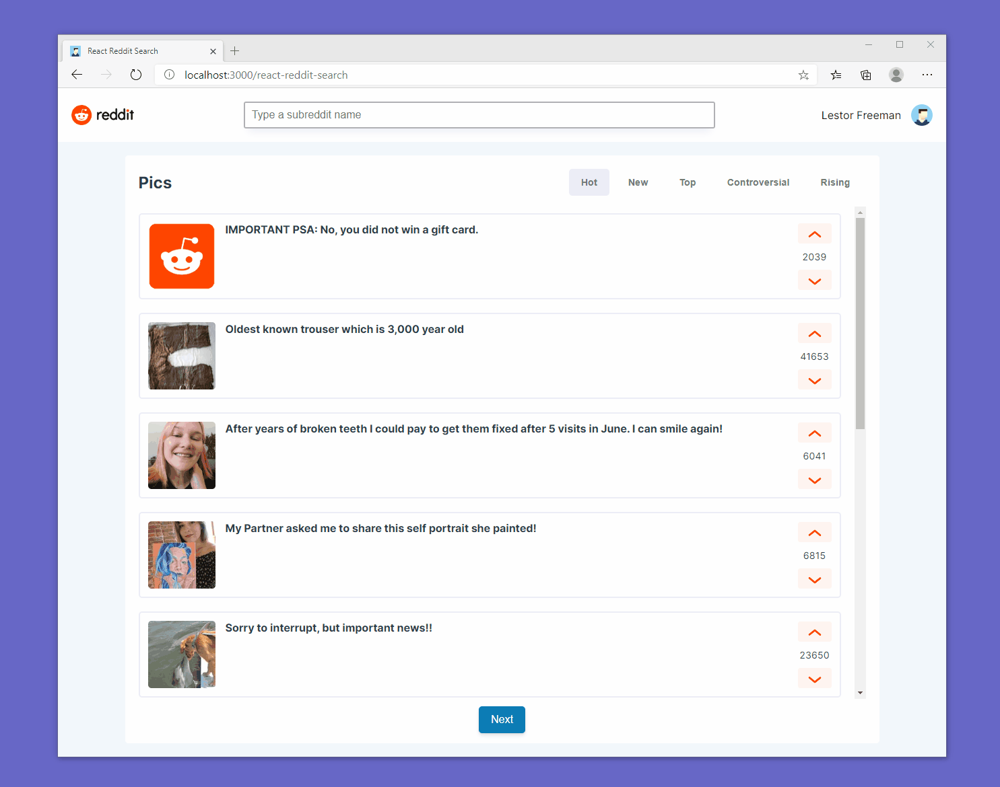
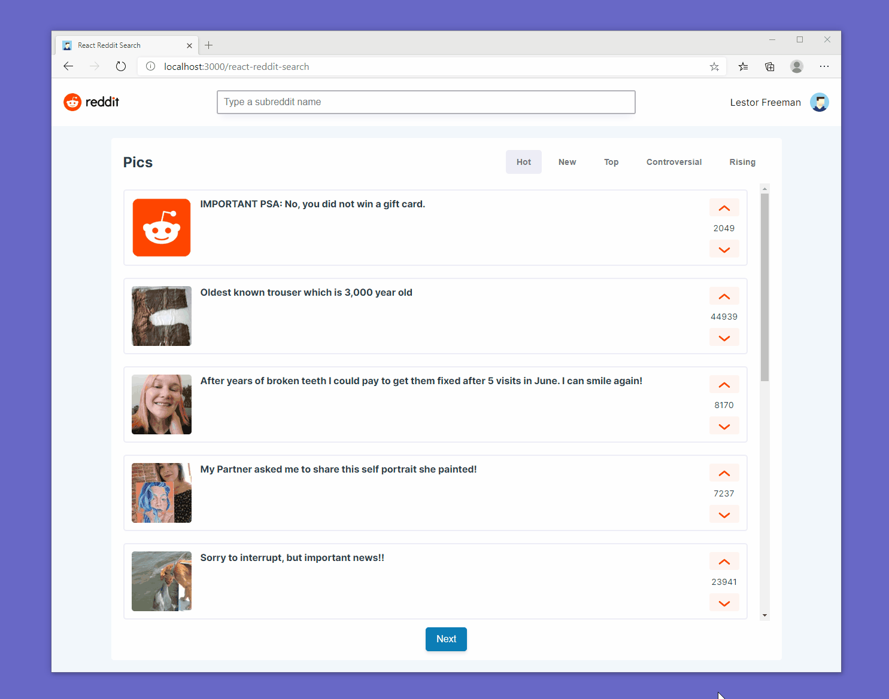
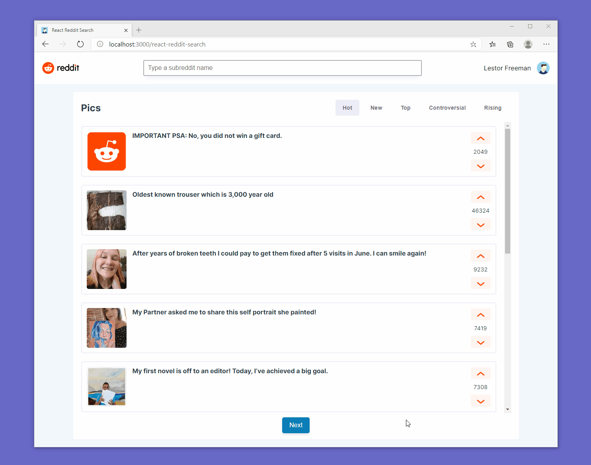

<h1 align="center">  
   
  React Reddit Search 
   
  </h1>

 

This project shows usage of the Reddit API using ReactJS, Redux Toolkit and Typescript 💻

  
  
  

## Includes

- [Redux Toolkit][redux-toolkit]
- [Typescript][typescript]
- [Styled Components][styled-components]
- [Styled Icons Pack][styled-icons]
- [Jest][jest]
- [React Testing Library][react-testing-library]
- [ESLint][eslint]
- [Prettier][prettier]
- [Github Actions CI/CD][github-actions]
- [Source Map Explorer][source-map-explorer] to analyze code bloat

&nbsp;

## Live Demo

[Check out the live demo](https://cmacdonnacha.github.io/react-reddit-search/)

&nbsp;

## Set up

1. `git clone https://github.com/cmacdonnacha/react-reddit-search.git react-reddit-search`
2. `cd react-reddit-search`
3. `npm install`
4. `npm start`
5. Go to http://localhost:3000/react-reddit-search
6. That's it! See the **Available Commands** list below for more.

&nbsp;

## Available Commands

### `npm start`

Runs the app in the development mode. 
Open [http://localhost:3000](http://localhost:3000) to view it in your browser.

### `npm test`

Runs unit and integration tests in watch mode. Use `npm run test:no-watch` to run tests without a watcher. 

### `npm run test:no-watch`

Runs unit and integrations tests without a watcher.

### `npm run test:coverage`

Displays the code coverage within the console and also generates a coverage folder.

> To view the code coverage report in your browser open the `index.html` file within the `coverage/lcov-report` folder.

### `npm run test:open`

Runs end-to-end tests and opens a window to see the results running on your machine.

### `npm run lint`

Runs the ESLint typescript code lint checker. Running `npm run lint:fix` will automatically fix any lint errors where possible.

### `npm run build`

Builds a production version of the app inside the `build` folder. 
It correctly bundles React in production mode and optimizes the build for the best performance.

### `npm run analyze`

This will run a production build and then analyze the output using [source-map-explorer] which analyzes JavaScript bundles using the source maps. This helps you understand where code bloat is coming from.

&nbsp;

## Features

<h3>🔍 &nbsp; Search subreddit posts</h3>

 <h3>🔥 &nbsp; Sort by Hot, New, Top, Controversial & Rising</h3>

 <h3>📃 &nbsp; Next and Previous pagination</h3>

 <h3>📞 &nbsp; Mobile friendly / Responsive design</h3>

 <h3>🔨 &nbsp; Error Handling</h3>

 <h3>♿ &nbsp; 100% Accessability Compliance (via Lighthouse)</h3>

 <h3>🧪 &nbsp; Unit & Integration tests</h3>

 <h3>🚢 &nbsp; Continuos Integration & Deployment with [Github Actions][github-actions]</h3>

&nbsp;

## License

Licensed under the MIT license.

&nbsp;

<!-- prettier-ignore-start -->
[npm]: https://www.npmjs.com/
[node]: https://nodejs.org
[continuous-integration-badge]: https://github.com/cmacdonnacha/react-reddit-search/workflows/Continuous%20Integration/badge.svg
[dependencies-badge]: https://img.shields.io/david/cmacdonnacha/react-reddit-search.svg
[package]: https://www.npmjs.com/package/cra-template-ideal-starter
[typescript]: https://github.com/microsoft/TypeScript
[redux-toolkit]: https://github.com/reduxjs/redux-toolkit
[jest]: https://jestjs.io/
[react-testing-library]: https://testing-library.com/docs/react-testing-library/intro
[cypress]: https://www.cypress.io/
[cra]: https://github.com/facebook/create-react-app
[source-map-explorer]: https://www.npmjs.com/package/source-map-explorer
[axios]: https://github.com/axios/axios
[eslint]: https://eslint.org/
[prettier]: https://prettier.io/docs/en/index.html
[github-actions]: https://github.com/cmacdonnacha/react-reddit-search/actions
[styled-icons]: https://styled-icons.js.org/
[styled-components]: https://styled-components.com/
<!-- prettier-ignore-end -->
